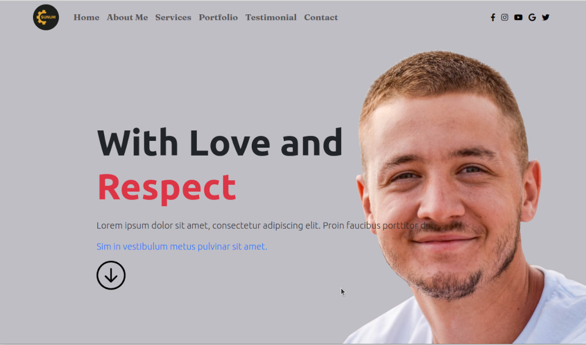
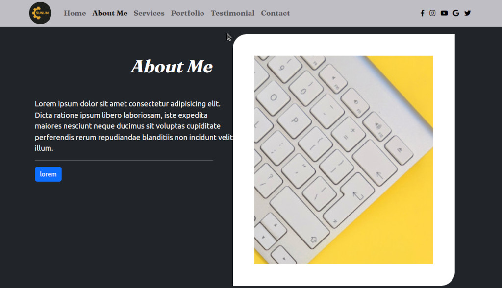
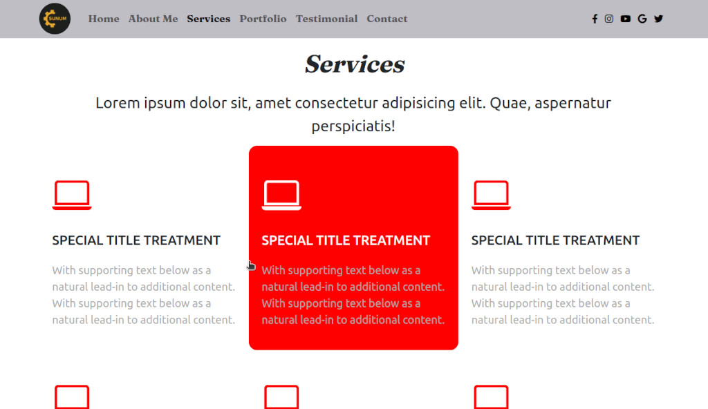
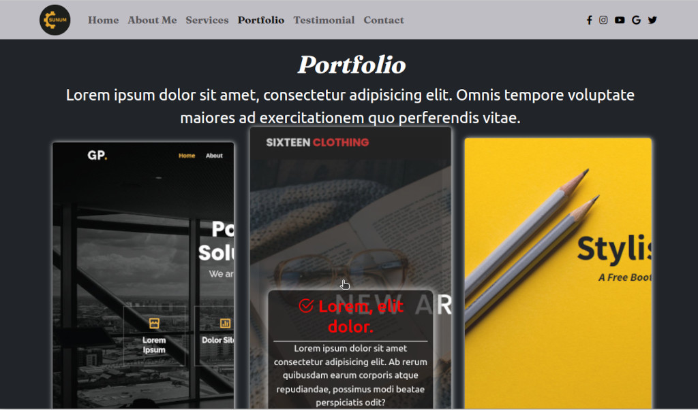
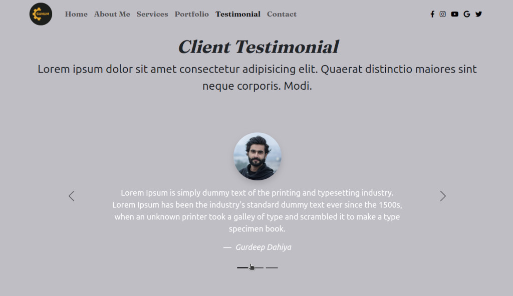
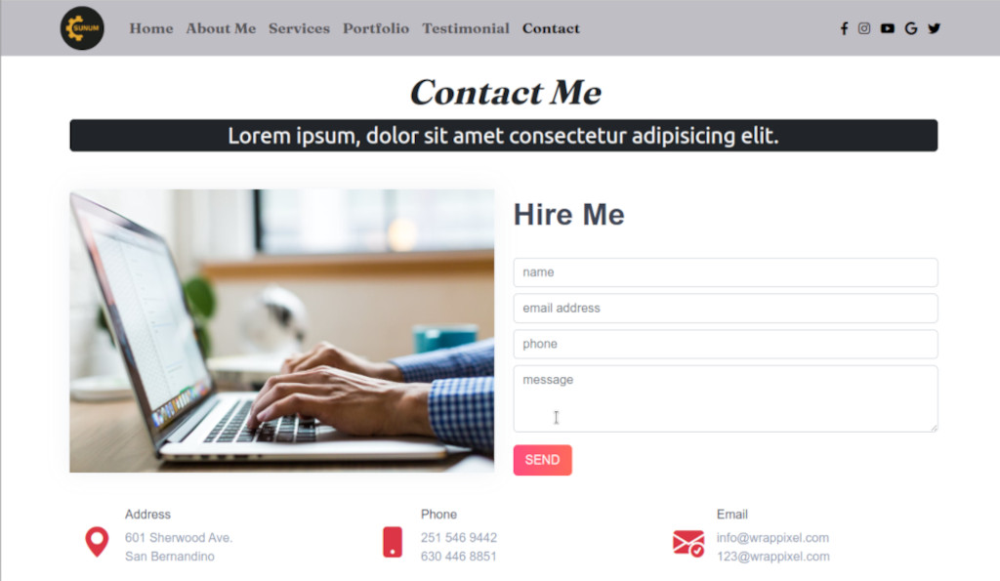

# The Sunum is a Portfolio Theme

A portfolio theme was created HTML, CSS and Bootstrap.

## Demo

You can see [demo](https://sunum.netlify.app/) on Netlify.

  
## Screenshots

  
## Used Rechnologies

- HTML, 
- CSS, 
- JavaScript,
- Bootstrap.
  
## Features

One page portfolio theme. There is a hero section, about me section, services section, works section, communication sections.